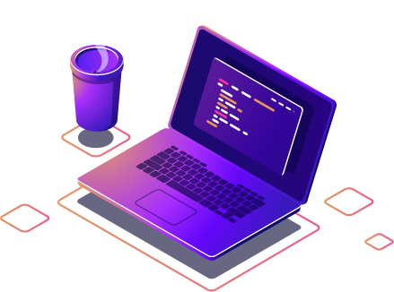

# **Clayton Silva dos Santos** 🖥🤖  ****
<!-- https://user-images.githubusercontent.com/74038190/212284087-bbe7e430-757e-4901-90bf-4cd2ce3e1852.gif -->

I am a Computer Science student specializing in **Artificial Intelligence** and **Machine Learning**, with experience developing and deploying ML models using frameworks such as **PyTorch** and **TensorFlow**. I have expertise in **Machine Learning system design** and **model optimization techniques**, including **weight pruning** and **structural pruning**.  

I have implemented neural network architectures including **Convolutional Neural Networks (CNNs)**, **Multilayer Perceptrons (MLPs)**, **3D Convolutional Networks (Conv3D)**, **Transformers**, and **Vision Transformers (ViTs)**, delivering solutions for image, text, and multimodal data.  

I also have experience in deploying and integrating AI models through **cloud platforms (Microsoft Azure)**, as well as via **API requests**, leveraging tools such as **Cognitive Services Pipelines**, **Form Recognizer**, **Azure Automated Machine Learning**, **Azure Designer**, **RAG workflows**, and **AI-powered chatbots** to deliver scalable, production-ready solutions.

---
## Certifications

  
  
    <a href="https://learn.microsoft.com/api/credentials/share/pt-br/ClaytonSilvadosSantos-3005/118CFB27A29A4A19?sharingId"><strong>Microsoft Certified: Azure AI Fundamentals (AI-900)</strong></a>
  

  
  
    <a href="https://www.sp.senai.br/consulta-certificado?qrcode=00035588/6984972"><strong>Privacidade e Proteção de Dados - LGPD</strong></a>
  

  
  
    <a href="https://www.sp.senai.br/consulta-certificado?qrcode=00042104/6984972"><strong>Ética na Inteligência Artificial</strong></a>
  

---

## Technologies & Tools

---

## Projects

### 🧠 Machine Learning

<table>
  <tr>
    <td>
      
2D Image Regression/Object Detection

      <a href="https://github.com/ClaytonSdS/VisionGauge"><strong>Vision Gauge - U-tube manometer detection/reader</strong></a>
      
Transfer Learning, Albumentations, PyTorch, CNN, Residual Blocks, Finetunning, ETL, OpenCV

    </td>
    <td>
      
2D Image Classification

      <a href="https://github.com/NeoGreenCode/SugarcaneLeafDisease"><strong>Sugarcane Leaf Disease Predictor</strong></a>
      
FCNN, CBAM, Xception, Residual Blocks, TensorFlow, OpenCV

    </td>
  </tr>
  <tr>
    <td>
      
3D Image Classification

      <a href="https://github.com/NeoGreenCode/AneurysmDetection"><strong>RSNA Intracranial Aneurysm Detection</strong></a>
      
Transfer Learning, 3D CNN, Multilabel Classification, K-Fold, Keras, OpenCV

    </td>
    <td>
      
MLP Binary Classification

      <a href="https://github.com/ClaytonSdS/DataHackers2025"><strong>Modelo de Classificação Binária para Previsão de Retorno ao Presencial</strong></a>
      
Fully Connected Neural Network, Dropout, ReLU, TensorFlow, Keras

    </td>
  </tr>
</table>

---

### 💻 Software Development (POC)

<table>
  <tr>
    <td>
      
CONTROLE DE ESTUDOS

      <a href="https://github.com/ClaytonSdS/StudyControl"><strong>Software para Controle de Estudos</strong></a>
      
Python, Kivy, KivyMD, HTML, TeX, kvlang

    </td>
    <td>
      
CONTROLE DE ESTOQUE

      <a href="https://github.com/ClaytonSdS/Storage"><strong>Software para Controle de Estoque</strong></a>
      
Python, Kivy, KivyMD, HTML, TeX, kvlang

    </td>
  </tr>
</table>

---

### 🗄️ Banco de Dados

* <strong>Banco de Dados E-commerce</strong>

---

### 📚 Research
<table>
  <tr>
    <td>
      Santos, C. S. dos, Arima, M. N., & Almeida, M. A. D. (2025). 
      <a href="https://doi.org/10.54033/cadpedv22n12-312" style="text-decoration:none; color:inherit;">
        <i>Desenvolvimento de simulador de rede de dutos e validação experimental em bancada de teste.</i>
      </a> 
      Caderno Pedagógico, v. 22 (n. 12), E21100, Qualis A2. DOI: 10.54033
    </td>
  </tr>
</table>

